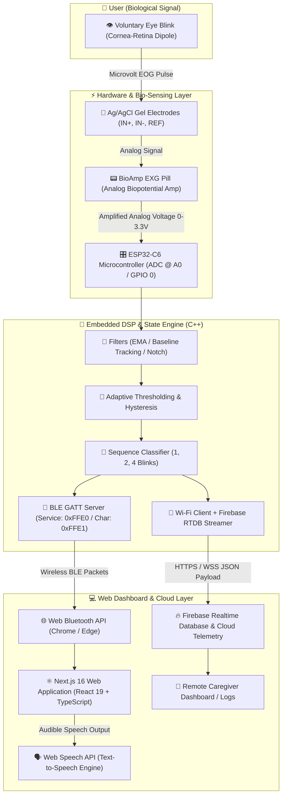

# 👁️ Mind-to-World (M2W) — Assistive Eye-Blink Communication System

[](https://nextjs.org/)
[](https://reactjs.org/)
[](https://www.typescriptlang.org/)
[](https://www.espressif.com/)
[](https://developer.mozilla.org/en-US/docs/Web/API/Web_Bluetooth_API)
[](https://firebase.google.com/)
[](https://tailwindcss.com/)

---

## 📌 Project Overview

### What is the Eye-Blink System (M2W)?
The **Mind-to-World (M2W) Eye-Blink System** is an end-to-end assistive communication and environmental control platform designed for individuals with severe motor disabilities, speech impairments, Locked-in Syndrome (LIS), Amyotrophic Lateral Sclerosis (ALS), or cerebral palsy.

By measuring minute biopotential changes generated by voluntary eye blinks using **Electrooculography (EOG)**, the system enables users to navigate interactive menus, trigger vocal announcements (Text-to-Speech), request caregiver assistance, and broadcast telemetry to the cloud — completely hands-free and voice-free.

---

## 🔄 End-to-End System Architecture



---

## 🛠️ Complete Tech Stack: What, How & Why

### 1. Hardware & Bio-Sensing Layer

| Technology | What it is | How we use it | Why we chose it |
| :--- | :--- | :--- | :--- |
| **ESP32-C6 (Espressif)** | Ultra-low-power 32-bit RISC-V SoC with integrated Wi-Fi 6, Bluetooth 5 (LE), and high-resolution ADC. | Samples the analog EOG signal at high frequency, executes real-time DSP filtering, classifies blink sequences, and hosts both BLE GATT and Wi-Fi transmission. | High processing performance, low cost, native 2.4 GHz BLE 5.0 + Wi-Fi 6 concurrency, hardware floating point, and energy efficiency. |
| **BioAmp EXG Pill (Upside Down Labs)** | Open-hardware analog front-end biopotential instrumentation amplifier. | Captures raw EOG (electrooculography) voltage variations between electrodes placed around the eye, amplifies microvolt signals into 0–3.3V ADC range. | Medical-grade signal fidelity, low noise floor, zero proprietary microcontroller lock-in, compact form factor, and safe low-voltage operation. |
| **Ag/AgCl Gel Electrodes** | Medical-grade disposable hydrogel surface electrodes. | Placed in 3-point EOG configuration: IN+ (above eye), IN- (below eye), and REF (bony mastoid process behind ear). | Low skin-contact impedance, stable electrochemical half-cell potential, and minimal motion artifact generation. |

---

### 2. Embedded Firmware & Digital Signal Processing (DSP)

| Component | What it is | How we use it | Why we chose it |
| :--- | :--- | :--- | :--- |
| **C++ / Arduino ESP32 Core** | Native compiled embedded C++ running on the FreeRTOS-backed ESP32 platform. | Orchestrates continuous ADC sampling, timing loops, circular buffers, and asynchronous network packets. | Deterministic microsecond execution speed, low memory footprint, and rich ecosystem of hardware drivers. |
| **Filters (`Filters.h/.cpp`)** | Digital signal smoothing algorithms including Exponential Moving Average (EMA) and dynamic baseline tracking. | Removes 50/60 Hz power-line interference, DC baseline wandering, and high-frequency muscle twitch noise from the EOG signal. | Prevents false positives caused by head movements or electrical ambient noise while keeping latency under 10ms. |
| **Adaptive Thresholding (`AdaptiveThreshold.h/.cpp`)** | Dynamic hysteresis comparator algorithm. | Adjusts the trigger and release voltage thresholds based on ambient baseline shifts and user-specific blink strengths. | Accommodates natural human physiological differences (strong vs. gentle blinks) and sensor gel dry-out over time. |
| **Sequence Classifier (`SequenceClassifier.h/.cpp`)** | Temporal pattern recognition state machine. | Groups individual blink events into discrete multi-blink gestures using precise time windows (`MIN_DURATION`, `MAX_DURATION`, `REFRACTORY_MS`, `INTER_BLINK_TIMEOUT`). | Converts raw physical eye twitches into deterministic software control commands (1 blink = navigate, 2 = select, 4 = activate). |
| **BLE GATT Service** | Custom Bluetooth Low Energy GATT profile (`Service: 0xFFE0`, `Characteristic: 0xFFE1`). | Broadcasts notify packets containing blink counts and state changes to paired web browsers. | Ultra-low latency (<20ms), minimal power consumption, and direct driverless browser connectivity via Web Bluetooth. |

---

### 3. Frontend Web Dashboard & User Interface

| Technology | What it is | How we use it | Why we chose it |
| :--- | :--- | :--- | :--- |
| **Next.js 16 (App Router)** | Modern full-stack React framework by Vercel. | Serves the web dashboard, manages client-side routing, and optimizes asset delivery. | Fast server-side rendering, robust modular routing architecture, and rapid developer iteration. |
| **React 19** | Component-based UI library with advanced concurrency and state hooks. | Powers the interactive cyclical menu, live status banners, connection indicators, and reactive event listeners. | Declarative state management (`useState`, `useEffect`, `useCallback`) ensures sub-millisecond UI updates when receiving BLE events. |
| **TypeScript 5** | Statically typed superset of JavaScript. | Strictly types BLE data packets, Firebase telemetry schemas, menu actions, and component properties. | Eliminates runtime bugs, guarantees data integrity between firmware payloads and UI logic, and improves maintainability. |
| **Tailwind CSS v4** | Utility-first, high-performance CSS styling engine. | Implements a high-contrast dark theme, neon focus rings, smooth transitions, and accessible large-format grid cards. | Instant visual feedback for motor/vision-impaired users, zero runtime CSS overhead, and fully responsive across tablets/laptops. |
| **Lucide React** | Feather-inspired clean SVG icon library. | Provides clear, universally understood visual pictograms for every action (Water, Food, Help/Nurse, Lights, Washroom, Outing). | Lightweight, high-contrast, scalable, and assists users who may have cognitive fatigue or reading difficulties. |

---

### 4. Browser APIs & Cloud Infrastructure

| Service / API | What it is | How we use it | Why we chose it |
| :--- | :--- | :--- | :--- |
| **Web Bluetooth API** | W3C browser standard allowing web apps to connect directly to nearby BLE peripherals. | Connects Chrome/Edge directly to the ESP32-C6 GATT server to receive live blink notifications over the air. | **Zero installation required.** No native apps, USB drivers, or external companion software needed on patient/caregiver computers. |
| **Web Speech API (`SpeechSynthesis`)** | Built-in browser audio synthesis engine. | Generates clear, audible vocal announcements (e.g., *"I need water, please"*, *"Calling nurse"*, *"System Activated"*) upon selection. | Instant zero-latency offline speech synthesis with zero external API costs or internet dependency. |
| **Firebase Realtime Database (RTDB)** | NoSQL cloud-hosted realtime database with WebSocket synchronization. | Synchronizes system activation state, blink counts, live navigation positions, and historical event logs in real time. | Sub-100ms multi-device synchronization allows doctors and family members in other rooms to monitor patient status in real time. |

---

## 🎮 Gesture & Control Protocol

The system utilizes an intuitive multi-blink encoding protocol:

```text
  [ 4 Blinks ] ───►  TOGGLE SYSTEM MODE (Active / Inactive Standby)
  [ 1 Blink  ] ───►  NAVIGATE NEXT (Cycles highlight: Food ➜ Nurse ➜ Outing ➜ TV ➜ Washroom ➜ Water)
  [ 2 Blinks ] ───►  SELECT & SPEAK (Confirms highlighted item & triggers voice output)
```

### Detailed Gesture Mapping

| Blink Gesture | Action Triggered | Visual Feedback | Spoken Voice Output |
| :---: | :--- | :--- | :--- |
| **4 Blinks** | **System Toggle** | Glowing active banner turns Green / Gray | *"System activated"* or *"System inactive"* |
| **1 Blink** | **Next Option** | Highlighted neon ring moves sequentially to the next menu card | Subtle click cue / visual indicator |
| **2 Blinks** | **Confirm Selection** | Active card pulses with confirmation animation | *"I need water, please"*, *"Call nurse immediately"*, etc. |

### Firmware Tuning Parameters (`firmware/firmware.ino`)

| Constant | Default Value | Technical Purpose |
| :--- | :---: | :--- |
| `BLINK_TRIGGER_THRESHOLD` | `250.0` | Peak ADC amplitude above baseline required to begin counting a blink pulse. |
| `BLINK_RELEASE_THRESHOLD` | `120.0` | Hysteresis lower bound that signal must drop below before accepting next pulse. |
| `MIN_BLINK_DURATION_MS` | `80 ms` | Rejects high-frequency noise spikes and electrical transients. |
| `MAX_BLINK_DURATION_MS` | `500 ms` | Rejects involuntary squinting, long eye closures, or head motion artifacts. |
| `BLINK_REFRACTORY_MS` | `150 ms` | Enforced refractory quiet period preventing double-counting a single physical blink. |
| `INTER_BLINK_TIMEOUT_MS` | `600 ms` | Maximum interval allowed between consecutive blinks before finalizing a sequence. |
| `MAX_SEQUENCE_WINDOW_MS` | `2500 ms`| Maximum total time allowed for an entire 4-blink sequence to complete. |

---

## 📂 Project Repository Structure

```text
Eye-Blink-System/
├── 🤖 firmware/                            # ESP32-C6 Embedded C++ Firmware
│   ├── firmware.ino                        # Main entry point (Setup, Loop, BLE GATT, Wi-Fi sync)
│   ├── BlinkDetector.h & .cpp              # Core blink state machine & peak validation
│   ├── AdaptiveThreshold.h & .cpp          # Dynamic baseline and threshold tracker
│   ├── Filters.h & .cpp                    # EMA and low-pass noise filters
│   ├── SequenceClassifier.h & .cpp         # Multi-blink decoder (1, 2, 4 blinks)
│   ├── Calibration.h & .cpp                # Startup baseline calibration routine
│   └── StateMachine.h & .cpp               # Global system operational states
│
├── 💻 M2W-main/                            # Next.js 16 Web Dashboard Application
│   ├── src/
│   │   ├── app/
│   │   │   ├── layout.tsx                  # Root layout, meta tags, and typography
│   │   │   ├── page.tsx                    # Main landing view
│   │   │   └── globals.css                 # Tailwind CSS 4 theme & custom glow utilities
│   │   ├── components/
│   │   │   └── Mainpage.tsx                # Interactive dashboard, Web BLE manager & TTS
│   │   └── lib/
│   │       └── firebase.ts                 # Firebase Realtime Database client & sync helpers
│   ├── public/                             # Static assets, icons, sound effects
│   ├── instruction.md                      # Detailed technical setup manual
│   ├── package.json                        # Frontend dependencies & npm scripts
│   ├── next.config.ts                      # Next.js configuration
│   └── tsconfig.json                       # TypeScript compiler options
│
└── README.md                               # Complete project documentation (this file)
```

---

## 🚀 Quick Start Guide

### Step 1: Hardware Connections (BioAmp to ESP32-C6)

| BioAmp EXG Pill Pin | ESP32-C6 Pin | Description |
| :--- | :--- | :--- |
| **VCC** | **3.3V** | Power Supply (3.3V DC) |
| **GND** | **GND** | Common Ground |
| **OUT** | **A0 (GPIO 0)** | Analog EOG Biopotential Output |

#### Electrode Placement
1. **IN+ (Positive Electrode):** Positioned directly **above** the eyebrow.
2. **IN- (Negative Electrode):** Positioned directly **below** the eye on the lower orbital rim.
3. **REF (Reference Ground):** Positioned on the **mastoid process** (bony area behind the ear) or earlobe.

---

### Step 2: Flash ESP32-C6 Firmware
1. Open **Arduino IDE (v2.x+)**.
2. Install the ESP32 board definitions from the Espressif Board Manager URL.
3. Open `firmware/firmware.ino`.
4. Select board: **ESP32C6 Dev Module** and choose your corresponding COM port.
5. *(Optional)* Configure Wi-Fi SSID, Password, and Firebase credentials in `firmware.ino` if cloud streaming is desired.
6. Click **Upload** (Arrow icon).
7. Open the **Serial Monitor** at `115200` baud rate to observe real-time calibration and BLE broadcast readiness.

---

### Step 3: Run the Web Dashboard
1. Navigate to the frontend directory:
   ```bash
   cd M2W-main
   ```
2. Install dependencies:
   ```bash
   npm install
   ```
3. Start the Next.js development server:
   ```bash
   npm run dev
   ```
4. Open [http://localhost:3000](http://localhost:3000) using **Google Chrome** or **Microsoft Edge**.
5. Click **"Connect Device"**, select the `ESP32C6_EEG` device from the browser pairing pop-up, and begin blinking!

---

## 🔒 Security, Privacy & Reliability

- **Driverless Web Bluetooth:** Operates completely inside the browser sandbox using user-authorized Web Bluetooth permissions; no unsigned native binaries or security risks.
- **Offline Fallback:** Core assistive communication and Text-to-Speech synthesis operate 100% locally in the browser, ensuring critical patient communication continues even during internet outages.
- **Hysteresis & Noise Shielding:** Multi-stage digital filtering rejects involuntary micro-twitches, saccadic eye movements, and ambient AC mains hum.

---

## 📄 License & Attribution

This project is licensed under the MIT License. Developed with ❤️ to make digital communication universal, accessible, and empowering for everyone.
