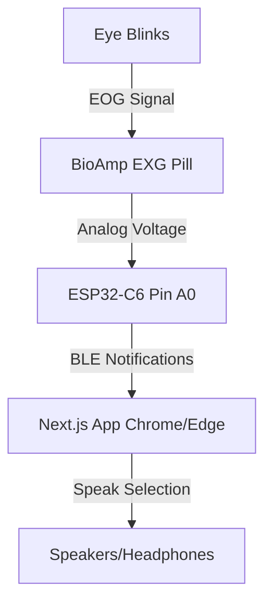

# M2W Eye-Blink System Setup and Operation Guide

This guide describes how to configure, upload, and run the M2W (Mind-to-Words) Eye-Blink system. The system translates eye-blink signals into communication controls using an ESP32-C6 microcontroller, a BioAmp EXG Pill sensor, and a Next.js web application.

---

## 1. System Architecture



- **Hardware:** ESP32-C6 microcontroller and BioAmp EXG Pill (EOG sensor).
- **Communication:** Bluetooth Low Energy (BLE) using custom Service and Characteristic UUIDs.
- **Frontend:** Next.js single-page application utilizing the Web Bluetooth API to receive real-time gesture commands.

---

## 2. Hardware Connections

Connect the **BioAmp EXG Pill** to the **ESP32-C6** (or similar ESP32 variant) as follows:

| BioAmp EXG Pill Pin | ESP32-C6 Pin | Description |
| :--- | :--- | :--- |
| **VCC** | **3.3V** | Power Supply (3.3V) |
| **GND** | **GND** | Ground |
| **OUT** | **A0 (GPIO 0)** | Analog output representing EOG signal |

### Electrode Placement (EOG)
For eye-blink detection, place the electrodes around one eye:
1. **Electrode 1 (Above Eye):** Positive electrode (IN+).
2. **Electrode 2 (Below Eye):** Negative electrode (IN-).
3. **Electrode 3 (Behind Ear / Mastoid):** Reference electrode (REF).

---

## 3. Firmware Setup (ESP32-C6)

### Prerequisites
- Install **Arduino IDE** (version 2.x or later recommended).
- Install the ESP32 board package in Arduino IDE:
  1. Open Arduino IDE and go to **File** -> **Preferences**.
  2. Add the following URL to the **Additional boards manager URLs**:
     ```text
     https://raw.githubusercontent.com/espressif/arduino-esp32/gh-pages/package_esp32_index.json
     ```
  3. Go to **Tools** -> **Board** -> **Boards Manager**, search for `esp32` by Espressif, and install it.

### Compile and Upload
1. Open `firmware/firmware.ino` in Arduino IDE.
2. Select your board: **Tools** -> **Board** -> **ESP32** -> **ESP32C6 Dev Module** (or your specific variant).
3. Connect the ESP32-C6 to your Windows system using a USB-C cable.
4. Select the correct COM port under **Tools** -> **Port**.
5. Calibrate the blink detector (if necessary):
   - Open **Tools** -> **Serial Monitor** at `115200` baud. The firmware prints `Raw`, `Filtered`, `BlinkDetected`, `BlinkCount`, `State`, and detector state.
   - With the eye relaxed, note the typical `Filtered` noise amplitude. Make `BLINK_TRIGGER_THRESHOLD` at least 1.5–2 times higher than that noise, but lower than a normal blink peak. The initial value is `250.0` ADC counts.
   - Keep `BLINK_RELEASE_THRESHOLD` below `BLINK_TRIGGER_THRESHOLD`; it provides hysteresis so a single pulse cannot be counted several times. The initial release value is `120.0`.
   - The firmware accepts a blink only after its filtered pulse returns below the release threshold. It rejects very short noise spikes and pulses longer than `MAX_BLINK_DURATION_MS`.
6. Click **Upload** (Arrow icon) to build and flash the code.
7. Open the **Serial Monitor** or **Serial Plotter** (set baud rate to `115200`) to verify initialization. You should see:
   ```text
   NeuroSpeak Firmware Initialized. Waiting for connection...
   ```

---

## 4. Frontend Setup (Next.js Application)

### Prerequisites
- **Node.js:** Ensure Node.js (version 18.x or later) is installed on your Windows system.
- **Web Bluetooth Compatible Browser:** You must use a browser that supports the Web Bluetooth API (e.g., **Google Chrome** or **Microsoft Edge**).

### Installation and Launch
1. Open a terminal in the `M2W-main` directory.
2. Install all dependencies:
   ```bash
   npm install
   ```
3. Start the local Next.js development server:
   ```bash
   npm run dev
   ```
4. Access the application by opening your browser and navigating to:
   ```text
   http://localhost:3000
   ```

---

## 5. Web Bluetooth Troubleshooting (Windows)

Windows has specific permissions and requirements for Web Bluetooth:

1. **Turn on Windows Bluetooth:** Ensure Bluetooth is enabled in Windows Settings (**Settings** -> **Bluetooth & devices**).
2. **Do Not Manually Pair:** Do *not* pair the `ESP32C6_EEG` device directly in Windows settings. The pairing should be initiated through the web application's **Connect Device** button.
3. **Enable Experimental Features (If Needed):**
   - If the browser does not prompt you with the device pairing dialog, type `chrome://flags` (or `edge://flags`) in the URL bar.
   - Search for **Web Bluetooth** or **Experimental Web Platform features** and ensure they are **Enabled**.
   - Relaunch the browser.

---

## 6. Gesture Workflow and Controls

Once connected, the web application enters communication mode based on real-time blink commands sent from the ESP32-C6:

| Gestures (Blink Count) | Action | System Status / Visual Feedback |
| :--- | :--- | :--- |
| **4 Blinks** | **Activate / Deactivate** | Enters/exits Communication Mode (Toggles the purple active banner) |
| **1 Blink** | **Navigate Menu** | Moves highlight sequentially through the options (Food -> Help -> Outing -> Television -> Washroom -> Water) |
| **2 Blinks** | **Select & Speak** | Confirms the highlighted option and plays its corresponding text-to-speech audio |

The browser announces **“System activated”** when four blinks turn the system on, and **“System inactive”** when four blinks turn it off. The ESP32 sends the state byte over BLE; the web application performs the spoken announcement.

### Blink tuning constants

All detection constants are near the top of `firmware/firmware.ino`:

| Constant | Purpose |
| :--- | :--- |
| `BLINK_TRIGGER_THRESHOLD` | Filtered magnitude needed to start a blink candidate. Raise it to reduce false positives; lower it to improve sensitivity. |
| `BLINK_RELEASE_THRESHOLD` | Lower hysteresis threshold that marks the end of a candidate pulse. |
| `MIN_BLINK_DURATION_MS` | Rejects short spikes; lower only if valid fast blinks are missed. |
| `MAX_BLINK_DURATION_MS` | Rejects sustained eye closures and motion artefacts. |
| `BLINK_REFRACTORY_MS` | Minimum quiet/debounce time before another blink may count. |
| `INTER_BLINK_TIMEOUT_MS` | Quiet time that ends a 1- or 2-blink command sequence. |
| `MAX_SEQUENCE_WINDOW_MS` | Maximum first-to-last duration allowed for an entire blink sequence. |
