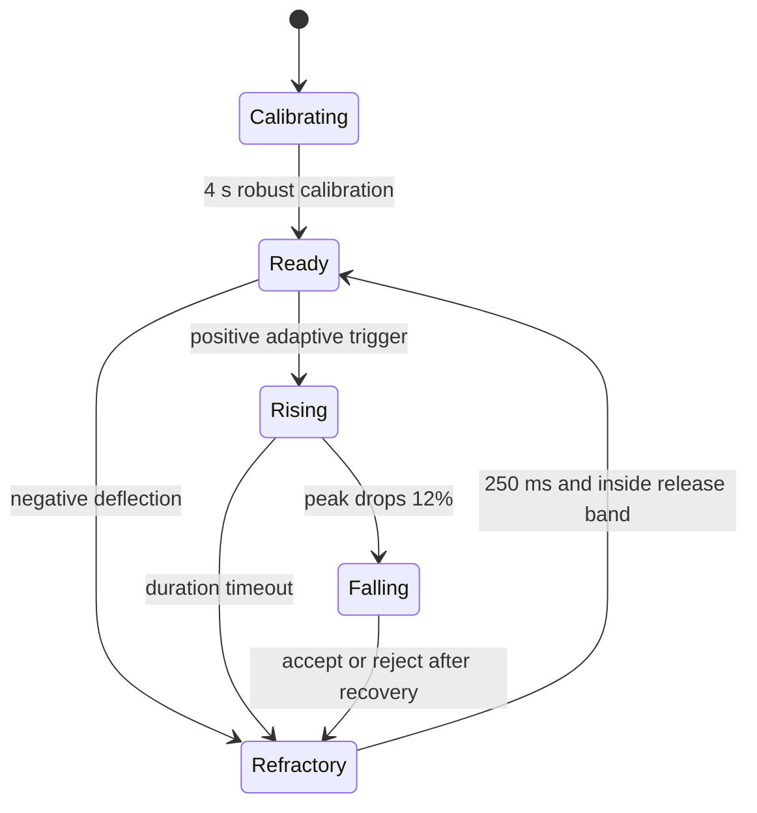

# Biomedical blink detector

The detector is the only refactored subsystem. BLE UUIDs, command bytes, Firebase `/live_data` payload, Wi-Fi task, menu behavior, and GPIO0 ADC selection remain unchanged.

## Pipeline and mathematics

The ADC is sampled at 500 Hz (`Ts = 0.002 s`). The adaptive DC tracker is
`b[n] = b[n-1] + 0.0004(x[n]-b[n-1])`; its output is `x[n]-b[n]`. This slowly removes electrode polarization without a fixed ADC offset.

The 0.5 Hz high-pass is `y[n] = 0.9937365(y[n-1]+x[n]-x[n-1])`, where `0.9937365 = exp(-2*pi*0.5/500)`. The 10 Hz low-pass is a second-order Butterworth biquad:

`y[n] = 0.00362168x[n] + 0.00724336x[n-1] + 0.00362168x[n-2] + 1.82269493y[n-1] - 0.83718165y[n-2]`.

A 3-point median removes impulsive ADC/EMI samples; a 5-sample moving average then reduces residual high-frequency noise with 8 ms group-scale smoothing. Calibration records 2,000 filtered samples (4 s), computes the median baseline, MAD `median(|x-median(x)|)`, and robust sigma `1.4826*MAD`; RMS is also calculated. Running baseline and noise update only in quiet READY state with EMA beta `0.001`.

Dual thresholds are `baseline ± 4.0*noise` for onset and `baseline ± 1.6*noise` for recovery. A candidate records positive/negative peaks, prominence, width/duration, positive area, squared energy, rise slope, fall slope, and saturation. It is accepted only after physiological duration, recovery, slope, asymmetry, SNR/energy confidence, and a 250 ms refractory check. Broad slow deflections are rejected as gaze/head movement; negative deflections, saturation, short spikes, and prolonged closures are rejected separately.

## State and command flow

Accepted blinks enter a sequence classifier. One or two blinks dispatch after 500 ms of quiet. A quad command requires all four blinks, each separated by 180–650 ms, and total span no more than 2.2 s. Thus four independent threshold crossings cannot toggle the system without a valid intentional sequence.

## Debug mode

Uncomment `#define DEBUG_BLINK` in `firmware.ino`, then open Arduino Serial Plotter at 115200 baud. The 50 Hz numeric trace includes raw/filtered values, baseline, noise, both thresholds, peaks, prominence, pulse width/duration/energy, confidence, accepted/rejected flag and reason code, FSM/menu state, BLE packet fields, Firebase HTTP result, missed deadlines, and worst lateness.

Reason codes: `0 NONE`, `1 SHORT`, `2 LONG`, `3 SAT`, `4 EYE_MOVE`, `5 RECOVERY`, `6 SHAPE`, `7 CONF`, `8 NEGATIVE`. FSM codes follow `Calibrating, Ready, Rising, Falling, Refractory, Rejecting` in declaration order.

## Resources and tuning

Static detector RAM is dominated by the 2,000-float calibration buffer: 8,000 bytes. Runtime filtering, sequence storage, and pulse state are under 300 bytes; no dynamic allocation or `String` is used in detector modules. The per-sample workload is a small fixed number of float operations plus one median sort of three values; expected detector CPU use is well below 20% on ESP32-C6 at 500 Hz. `Missed` and `LateUs` must be observed on the target to validate this estimate.

If valid blinks are missed, first verify electrode impedance and signal polarity, then reduce onset multiplier from `4.0` toward `3.5`. If false positives occur, increase it toward `4.5–5.0`, increase minimum pulse duration, or tighten the slow-rise check. Alter one parameter at a time and record raw traces; user calibration is automatic and should be performed while still.

| Capability | Previous detector | New detector |
|---|---|---|
| Sampling | 250 Hz loop | 500 Hz cadence with missed-deadline counter |
| Noise model | trimmed SD | median/MAD plus RMS and quiet-state EMA |
| Decision | threshold pulse | dual thresholds, prominence, energy, slopes, recovery, confidence |
| Artifacts | duration and derivative heuristic | saturation, negative polarity, short spike, broad movement, recovery and shape rejection |
| Multi-blink | count-first | timing-validated sequence classifier |
